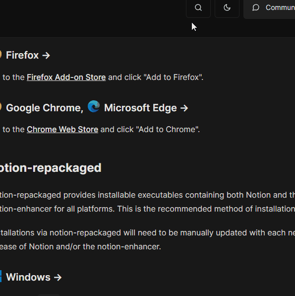

# 🧠 psyche

**psyche** is a drop-in solution for searching documentation,
inspired by Algolia's [DocSearch](https://docsearch.algolia.com/).

- It **looks and feels awesome** to use.
- Searching is **fast, accurate and typo-tolerate**.
- It can be included in any **static or server-generated** documentation website.
- It doubles as a **keyboard-navigable sitemap**.
- It makes registering **site-wide, platform-dependent hotkeys** simple.
- It's **mobile-friendly**.
- It supports both **light and dark modes**.

Check out the [notion-enhancer documentation](http://notion-enhancer.github.io/) for a live demo.



> **Warning:** psyche is built specifically for searching documentation.
> It is not built for implementation into other interfaces (e.g. eCommerce)
> or use with custom data schemes.

## Getting started

### Generating an index

The psyche client requires a pre-generated index of results to search.
This should be an array of `Result` records (see [types.d.ts](./types.d.ts#L10)).
Indexes are provided to the client programmatically, but should take the
form of an unformatted/minified `.json` file.

Indexers are plugins/middleware that crawl a site and generate an index,
either during a build process or on-the-fly if the site is dynamically served.

Indexers for some documentation generators are provided below.
If your generator of choice is not yet supported, either open a
[feature request](https://github.com/dragonwocky/psyche/issues)
or write your own and open a [pull request](https://github.com/dragonwocky/psyche/pulls).

#### [🔥 Lume](https://lumeland.github.io/)

Add the following to your `_config.ts` file:

```ts
import psyche from 'https://deno.land/x/psyche/indexers/lume.ts';

site.use(psyche());
```

The indexer can be configured by providing a `LumeConfig` object
as the first argument of the `psyche()` call (see [types.d.ts](./types.d.ts#L133)).

By default:

- The index will be output to `/search.json`.
- Pages without `data.section` or where `data.draft = true` will be ignored.
- Pages will be grouped by `data.section_order` & sorted by `data.order`.
- Page titles are accessed from `data.title`.
- Page sections are accessed from `data.section`.
- Headings, code blocks, paragraphs and lists within an `<article></article>` element
  in a page are indexed according to semantic HTML. Other elements (e.g.
  `<blockquote></blockquote>`) are treated as paragraphs. This works best
  with markdown output.

Read the [page data](https://lumeland.github.io/creating-pages/page-data/)
and/or [shared data](https://lumeland.github.io/creating-pages/shared-data/)
pages of Lume's documentation to see how to set these properties.

### Including the client

The psyche client is written in TypeScript. You can either directly import
it if your site's assets will be bundled by e.g. [ESBuild](https://esbuild.github.io/),
or import the pre-transpiled and minified JavaScript build.

```js
import psyche from 'https://deno.land/x/psyche/client/mod.ts';
// or
import psyche from 'https://deno.land/x/psyche/client/psyche.min.mjs';
```

The `psyche` default export is a function that when provided with
a `ClientConfig` object (see [types.d.ts](./types.d.ts#L31)) will
return a `ClientInstance` (see [types.d.ts](./types.d.ts#L109)).

Calling `.register()` on a client instance will insert the component
into the document and listen for hotkey presses. The component can
then be opened either by calling `.open()` or by pressing `CTRL/⌘ + K`.

E.g.

```js
const searchInstance = psyche({
  theme: { scrollbarStyle: 'square' },
  index: await fetch('/search.json').then((res) => res.json()),
});
searchInstance.register();
searchInstance.open();
```

#### Registering hotkeys

To add a hotkey to the list in the search modal,
add it to the `hotkeys` array of psyche's `ClientConfig`
object (see [types.d.ts](./types.d.ts#L31)). The special
`{{platformModifier}}` can be used within the `kbd` property
of a hotkey for platform-dependent hotkeys: equivalent
to the <kbd>Command (⌘)</kbd> key on MacOS or the <kbd>CTRL</kbd>
key on other platforms.

To handle hotkeys, provide a `ClientHotkey` object (see [types.d.ts](./types.d.ts#L126))
to the named export `registerHotkey`. This is a `KeyboardEvent` partial with a few
additional properties:

- the `platformModifier` hotkey is equivalent to `metaKey` on MacOS
  or `ctrlKey` on other platforms (for use with the `{{platformModifier}}`
  described above).
- the `onkeydown` property will be called when the key combination is pressed
  down, passed the triggered `KeyboardEvent` as its first argument.
- the `onkeyup` property will be called when the key combination is released,
  passed the triggered `KeyboardEvent` as its first argument.

E.g.

```js
import psyche, { registerHotkey } from 'https://deno.land/x/psyche/client/psyche.min.mjs';

registerHotkey({
  key: 'l',
  platformModifier: true,
  shiftKey: true,
  onkeydown: (event) => {
    event.preventDefault();
    toggleTheme();
  },
});

const searchInstance = psyche({
  hotkeys: [{ kbd: '{{platformModifier}} + SHIFT + L', label: 'to toggle theme' }],
});
searchInstance.register();
```

---

Changes to this project are recorded in the [CHANGELOG](CHANGELOG.md).

This project is licensed under the [MIT License](LICENSE).

To support future development of this project, please consider
[sponsoring the author](https://github.com/sponsors/dragonwocky).
